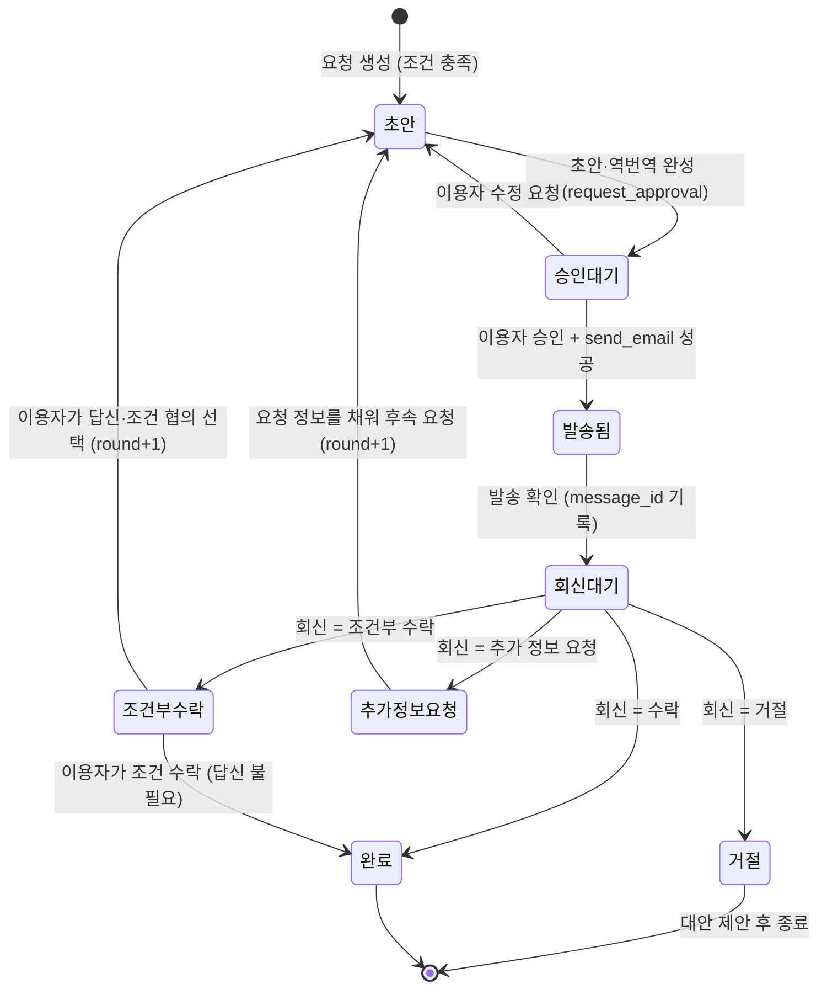

# 마중 — 아키텍처 설계

> 관련 문서: [PRD.md](PRD.md), [BACKLOG.md](BACKLOG.md), 원본 컨셉 [../concept.md](../concept.md)
> 기술 스택은 **후보 A (TypeScript 풀스택)로 확정**했다 (§8-0). 이 문서의 데이터 예시는 JSON·YAML 표기이며, 구현할 때 TypeScript 타입으로 옮긴다.

## 0. 설계 가정

| # | 가정 | 근거 |
|---|---|---|
| A1 | 이용자 1명이 여행 보드 1개를 쓴다. 로그인은 없다 | 10일 범위 |
| A2 | 이용자 언어 기본값은 영어. 역번역 언어는 보드의 `user_language`를 따른다 | 컨셉에 언어 범위가 없음 |
| A3 | 메일은 기본적으로 **모의 발송**(outbox 저장)한다. 회신은 시연 화면에서 붙여넣거나 샘플을 골라 넣는다 | 컨셉 6장 "개발·시연 중 모의 발송" |
| A4 | "도착까지 촉박" = 도착 예정까지 **6시간 미만**. 요청 유형 데이터에서 바꿀 수 있다 | 컨셉에 기준값이 없음 |
| A5 | 늦은 체크인 판단 기준: 숙소의 체크인 마감 시각을 알면 그 이후, 모르면 **22:00 이후** 도착 | 컨셉 예시 "새벽 1시" |
| A6 | 시각이 들어가는 판단(채널 판단, 먼저 챙겨주기)은 모두 `now`를 입력으로 받는 순수 함수로 만든다 | 테스트·시연 재현성 |

---

## 1. 전체 구성

```
┌──────────────────────── 웹 UI ────────────────────────┐
│  채팅  │  내 여행 보드  │  승인 카드  │  알림(먼저 챙겨주기) │
└───────────────┬───────────────────────────────────────┘
                │ 이용자 메시지 / 승인 / 회신 입력
                ▼
        ┌───────────────┐   긴급·행정이면 여기서 종료
        │ safety_guard  │──────────────▶ 공식 번호 / 1345 카드
        └───────┬───────┘
                ▼
        ┌──────────────────────────────┐
        │        에이전트 루프           │◀── 요청 유형 데이터 (YAML/JSON)
        │  LLM + 도구 레지스트리          │
        └───┬─────────────┬────────────┘
            │ 도구 호출     │ 상태 전이 요청
            ▼             ▼
   ┌────────────┐   ┌────────────────┐   ┌──────────────┐
   │   도구들    │   │ 요청 상태 머신   │──▶│ 이벤트 로그    │──▶ 지표 리포트
   └─────┬──────┘   │ (승인 게이트)    │   └──────────────┘
         │          └───────┬────────┘
         ▼                  ▼
   ┌─────────────────────────────┐      ┌─────────────────────┐
   │   저장소: 여행 보드·요청       │◀────│ 먼저 챙겨주기 규칙 엔진 │
   └─────────────────────────────┘      └─────────────────────┘
                    │ 발송(승인된 것만)
                    ▼
            ┌─────────────────┐
            │ 메일러 (모의/실제) │
            └─────────────────┘
```

**핵심 원칙: LLM은 판단하고, 코드는 지킨다.**
- LLM이 맡는 일: 도구 선택, 요청문 작성, 역번역, 회신 해석, 다음 행동 제안
- 코드가 강제하는 일: 상태 전이 규칙, **승인 게이트**, 긴급 차단, 루프 한도, 개인정보 필터, 먼저 챙겨주기 규칙 평가

---

## 2. 에이전트 루프

### 2-1. 루프를 시작하는 이벤트
| 이벤트 | 예 |
|---|---|
| 이용자 메시지 | "I'll arrive at 1:30 AM. Can you tell my hotel?" |
| 이용자 결정 | 승인, 수정 요청, 대안 선택, 질문에 대한 답 |
| 회신 도착 | MVP에서는 시연 화면에서 회신을 붙여넣을 때 |
| 먼저 챙겨주기 알림 수락 | 알림의 "처리하기" 버튼 |

### 2-2. 한 번의 루프

```
입력 이벤트
  │
  ▼
[0] safety_guard ── 긴급/행정 ──▶ 공식 안내 카드 표시 후 종료 (루프 미실행)
  │ 정상
  ▼
[1] 컨텍스트 구성: 보드 스냅샷 + 진행 중 요청 + 요청 유형 정의
                   + 현재 상태에서 허용된 도구 목록만 노출
  │
  ▼
[2] LLM이 다음 행동 결정 ─┬─ 도구 호출 ─▶ [3] 도구 실행 ─▶ [4] 결과 관찰
                         │                                  │
                         │        ◀──────── 결과를 컨텍스트에 추가 ─┘
                         │
                         └─ 이용자에게 응답 / 질문 / 승인 요청 ─▶ [5] 일시 정지 또는 종료
```

- **조건 확인 → 도구 선택 → 실행 → 결과 관찰 → 다음 행동 결정**이 [1]~[4]의 반복에 해당한다.
- [1]에서 요청 상태에 따라 노출할 도구를 제한한다. 예를 들어 `send_email`은 요청이 `승인 대기`이고 승인 기록이 있을 때만 노출한다.
- 루프의 상태(진행 중 요청, 마지막 단계)는 저장소에 두므로, 일시 정지 후 다른 이벤트로 이어서 진행할 수 있다.

### 2-3. 종료 조건

| 종류 | 조건 | 종료 시 동작 |
|---|---|---|
| 목표 달성 | 요청이 `완료`가 되었거나, `거절` 후 대안 제안까지 마쳤다 | 결과 요약 표시, 보드 갱신 |
| 이용자 대기 (일시 정지) | 승인, 빠진 조건 입력, 대안 선택이 필요하다 | 질문·승인 카드 표시. 다음 이용자 이벤트로 재개 |
| 외부 대기 (일시 정지) | 요청이 `회신 대기`다 | 대기 표시. 회신 입력 이벤트로 재개 |
| 안전 중단 | `safety_guard`가 긴급 또는 행정(범위 밖)으로 판정했다 | 공식 번호 / 1345 안내. 대행하지 않음 |
| 반복 한도 | 한 번의 루프에서 도구 호출이 **8회**를 넘었다 (가정값) | 지금까지 한 일과 막힌 지점을 이용자에게 보고 |
| 반복 감지 | 직전에 **성공한** 호출과 같은 도구·같은 입력으로 다시 호출했다 (실패 후 재시도는 아래 "도구 오류"가 맡는다) | 위와 같음 |
| 도구 오류 | 같은 도구가 **2회 연속** 실패했다 | 오류를 이용자 언어로 설명하고, 가능하면 준비 단계(전화 스크립트 등)로 낮춰 제안 |

### 2-4. 늦은 체크인 문의의 루프 흐름 (예)

```
이용자: "I'll arrive at 1:30 AM" + 예약 메일 붙여넣기
 → board_get                         관찰: 숙소 정보 없음
 → extract_booking_info              관찰: 숙소명·이메일·예약번호·체크인일 추출 (신뢰도 높음)
 → board_update                      관찰: 보드 저장 완료
 → check_conditions(late_checkin)    관찰: 모든 필수 조건 충족
 → decide_channel                    관찰: 도착까지 30시간 → email
 → draft_request_ko → back_translate 관찰: 초안 완성
 → request_approval                  ── 일시 정지 (승인 대기)
이용자: 승인
 → send_email (승인 게이트 통과)       관찰: 발송됨 → 회신 대기  ── 일시 정지 (외부 대기)
회신 입력
 → interpret_reply                   관찰: 조건부 수락, 조건 = "도어락 비밀번호 당일 메일 안내"
 → propose_next                      관찰: 감사·확인 회신 초안 제안 ── 일시 정지 (이용자 결정)
```

---

## 3. 도구 목록

| 이름 | 목적 | 입력 | 출력 | 실행 단계 | 승인 필요 | 도입 |
|---|---|---|---|---|---|---|
| `safety_guard` | 긴급·행정 질문 감지. LLM 도구가 아니라 루프 앞단 전처리 | 이용자 메시지 | `emergency` / `out_of_scope` / `ok` + 안내 카드 | 안내 | 아니오 | P1 (MVP는 통과만) |
| `board_get` | 여행 보드 조회 | 필드 경로(선택) | 보드 스냅샷 | 준비 | 아니오 | MVP |
| `board_update` | 여행 보드 쓰기 | 필드, 값, 출처(`user`/`extracted`) | 갱신된 보드 | 준비 | 아니오 | MVP |
| `check_conditions` | 요청 유형의 필수 조건을 보드와 대조 | `type_id`, 대상 ID | 충족 목록, 누락 목록 | 준비 | 아니오 | MVP |
| `ask_user` | **누락된 조건만** 이용자에게 질문 (루프 일시 정지) | 누락 목록 | 질문 메시지 | 준비 | 아니오 | MVP |
| `extract_booking_info` | 붙여넣은 예약 정보에서 숙소명·연락처·예약번호·예약자명·날짜 추출 | 예약 정보 원문 | 구조화 필드 + 필드별 신뢰도 | 준비 | 아니오 (원문은 저장하지 않음) | MVP |
| `decide_channel` | 메일 / 전화 중 채널 결정 | 유형의 채널 규칙, 도착 예정 시각, `now`, 보유 연락처 | 채널 + 사유 | 준비 | 아니오 | MVP |
| `draft_request_ko` | 한국어 요청문 작성 | 유형의 요청문 지침, 조건 값 | 제목, 본문 (한국어) | 준비 | 아니오 | MVP |
| `back_translate` | 한국어 본문을 이용자 언어로 역번역 | 한국어 본문, `user_language` | 역번역문 | 준비 | 아니오 | MVP |
| `request_approval` | 원문과 역번역을 나란히 보여주고 상태를 `승인 대기`로 전환 | `request_id` | 승인 카드 | 준비 | — (승인 절차 자체) | MVP |
| `send_email` | 메일 발송 (모의 / 실제) | `request_id` | `message_id`, 발송 시각, 모드 | 대행 | **예 (코드로 강제)** | MVP(모의) / P3(실제) |
| `ingest_reply` | 회신 등록 | `request_id`, 회신 원문 | `reply_id` | 대행 | 아니오 | MVP (수동 입력) |
| `interpret_reply` | 회신 해석 + 4분류 + 조건·요구 정보 추출 + 이용자 언어 요약 | 회신 원문, 원 요청 | 분류, 조건 목록, 요약, 신뢰도 | 대행 | 아니오 (신뢰도가 낮으면 이용자 확인) | MVP |
| `propose_next` | 후속 요청 초안 또는 대안 제안 | 해석 결과, 유형의 `follow_ups` | 제안 목록 | 준비 | 아니오 (후속 발송은 다시 승인) | MVP |
| `make_phone_script` | 한국어 전화 스크립트 + 발음 + 예상 응답 | 조건 값, `user_language` | 스크립트, 발음 표기, 예상 응답 문장 | 준비 | 아니오 | MVP |
| `run_proactive_check` | 먼저 챙겨주기 규칙 평가 | 보드, `now` | 알림 목록 | 안내 | 아니오 | P1 |
| `make_show_card` | 보여주기 카드 생성 | 목적(주소 / 식이 제한 / 목적지) | 한국어 카드 | 준비 | 아니오 | P2 |
| `suggest_transport` | 공항 이동·도시 간 이동 후보와 공식 예매 링크 | 출발지, 도착지, 시각, 짐 | 후보 목록 + 링크 | 안내 / 준비 | 아니오 | P2 |
| `interpret_photo` | 메뉴판·안내문 사진 해석 | 이미지 | 이용자 언어 설명 | 안내 | 아니오 | P3 |
| `search_places` | 테마·지역별 장소 검색 (TourAPI) [확인 필요] | 테마, 지역 | 장소 카드 | 안내 | 아니오 | P3 |

> **구현 메모 (M7·M8)**: `draft_request_ko` → `back_translate` → `request_approval`은 에이전트에게 **`draft_request` 도구 하나**로 노출한다. LLM이 역번역이나 승인 단계를 건너뛸 수 없게 하려는 것이다. 역번역은 초안 작성과 분리된 LLM 호출이 한국어 원문만 보고 수행한다. `ask_user`와 `draft_request`는 실행 후 루프를 멈추고(`awaiting_user`) 이용자의 답이나 승인을 기다린다.

### 승인 게이트 (코드에서 강제)
`send_email`은 LLM의 판단과 관계없이 다음을 모두 확인한 뒤에만 발송한다.
1. 요청 상태가 `승인 대기`다.
2. `approval` 기록이 있고, 승인한 주체가 이용자다.
3. 승인 당시 본문의 해시(`approval.draft_hash`)가 현재 본문의 해시와 같다. 승인 뒤 본문이 바뀌면 다시 승인을 받는다.
4. 실제 발송 모드에서는 수신 주소가 허용 목록(팀 소유 주소)에 있다.

---

## 4. 여행 보드 데이터 모델

### 4-1. 구조

```
TripBoard
├─ id, created_at, updated_at
├─ user_language          "en"
├─ traveler_role          "traveler" | "business" | "trainee"
├─ arrival                { datetime, airport, terminal?, flight_no? }
├─ departure              { datetime?, airport?, flight_no? }
├─ stays[]                Stay
├─ itinerary[]            { date, city, transport: { status, note? } }
├─ requests[]             Request
├─ proactive              { dismissed: [{ rule_id, target_id, until }] }
└─ events[]               Event  (지표용)

Stay
├─ id, name, name_ko?, address_ko?
├─ email?, phone?
├─ booking_ref, guest_name
├─ check_in_date, check_out_date
├─ expected_arrival       도착 예정 일시
├─ checkin_cutoff?        숙소 체크인 마감 시각 (알면)
├─ checkout_time?         기본 11:00 (가정)
└─ field_sources          { 필드명: "user" | "extracted" }  // 추출값은 이용자 확인 전까지 표시

Request
├─ id, type_id, target_id (stay_id 등), parent_request_id?, round
├─ status                 §5 상태 머신
├─ channel                "email" | "phone"
├─ slots                  { 조건 키: 값 }
├─ draft                  { subject_ko, body_ko, back_translation, hash }
├─ approval?              { approved_at, approved_by: "user", draft_hash }
├─ sent?                  { at, message_id, mode: "mock" | "real", to }
├─ replies[]              { id, received_at, raw_ko, interpretation }
│     interpretation      { class, conditions[], requested_info[], summary, confidence, needs_user_check }
└─ history[]              { from, to, at, actor: "user" | "agent" | "system", note? }

Event
└─ { at, kind: "user_action" | "tool_call" | "external_link" | "re_ask" | "state_change", request_id?, detail }
```

### 4-2. 예시 (JSON)

```json
{
  "id": "trip_001",
  "user_language": "en",
  "traveler_role": "traveler",
  "arrival": { "datetime": "2026-10-20T00:40+09:00", "airport": "ICN", "terminal": "T2", "flight_no": "KE908" },
  "departure": { "datetime": "2026-10-25T18:30+09:00", "airport": "GMP" },
  "stays": [{
    "id": "stay_1",
    "name": "Hotel Example Myeongdong",
    "email": "front@hotel-example.test",
    "phone": "+82-2-000-0000",
    "booking_ref": "BK123456",
    "guest_name": "Emma Smith",
    "check_in_date": "2026-10-19",
    "check_out_date": "2026-10-22",
    "expected_arrival": "2026-10-20T01:30+09:00",
    "field_sources": { "email": "extracted", "expected_arrival": "user" }
  }],
  "itinerary": [
    { "date": "2026-10-22", "city": "Gyeongju", "transport": { "status": "none" } }
  ],
  "requests": []
}
```

### 4-3. 개인정보 원칙

| 저장한다 | 저장하지 않는다 |
|---|---|
| 예약자명, 예약번호, 숙소명·연락처, 날짜·시각 | 붙여넣은 예약 메일 **원문** (추출 후 폐기) |
| 보낸 요청문, 받은 회신 원문 (해석 근거) | 여권번호, 카드번호, 생년월일 (요청하지 않고, 입력되면 마스킹) |
| 상태 이력과 이벤트 (지표용) | 이용자 위치 추적 정보 |

- LLM에 보내는 컨텍스트에도 해당 요청에 필요한 필드만 넣는다.
- 요청 유형 데이터의 `must_not_include`에 개인정보 금지 항목을 둔다.

---

## 5. 요청 상태 머신



### 전이 표

| 현재 | 다음 | 트리거 | 행위자 | 가드 (코드로 검사) |
|---|---|---|---|---|
| — | 초안 | 요청 생성 | agent | `check_conditions` 결과 누락 없음 |
| 초안 | 승인 대기 | 초안·역번역 완성 | agent | `draft.body_ko`, `draft.back_translation` 존재 |
| 승인 대기 | 초안 | 수정 요청 | user | — |
| 승인 대기 | 발송됨 | 승인 후 발송 성공 | user → system | 승인 게이트 4조건 (§3) |
| 발송됨 | 회신 대기 | 발송 확인 | system | `sent.message_id` 존재 |
| 회신 대기 | 완료 / 조건부 수락 / 거절 / 추가 정보 요청 | 회신 해석 | agent | `interpretation.confidence ≥ 0.7` 또는 이용자가 분류를 확인함 |
| 조건부 수락 | 완료 | 조건 수락 | user | — |
| 조건부 수락 | 초안 | 답신 선택 | user | `round` 증가 |
| 추가 정보 요청 | 초안 | 후속 요청 | agent | 요구 정보가 보드에 있거나 이용자가 입력함, `round` 증가 |

- 위 표에 없는 전이(예: `초안 → 발송됨`)는 거부하고 오류로 기록한다.
- **모든 전이는 `history`에 시각과 행위자를 기록**하고, 같은 내용을 `events`에 `state_change`로 남긴다.
- 해석 신뢰도가 0.7 미만이면 상태를 바꾸지 않고 `needs_user_check = true`로 회신 원문, 번역, 추정 분류를 보여준 뒤 이용자가 확인하면 전이한다. (0.7은 가정값)
- 거절 후의 대안(전화 스크립트, 다른 요청 유형)은 **새 요청**으로 만들고 `parent_request_id`로 연결한다.

---

## 6. 요청 유형 데이터 스키마

요청 유형은 **코드가 아니라 데이터 파일**로 정의한다. 새 유형은 파일 하나를 추가해서 붙인다. 유형별 `if` 분기를 코드에 두지 않는다.

### 6-1. 스키마

| 필드 | 필수 | 설명 |
|---|---|---|
| `id` | ✔ | 유형 식별자 (`late_checkin`) |
| `version` | ✔ | 스키마 버전 |
| `label` | ✔ | 언어별 표시 이름 `{ ko, en }` |
| `journey_stage` | ✔ | `before_arrival` / `airport` / `intercity` / `during_trip` / `departure` / `anytime` |
| `execution_level` | ✔ | `안내` / `준비` / `대행`. 연락 채널이 없으면 한 단계 낮춰 표시 |
| `target` | ✔ | 요청 대상: `stay` (보드의 숙소) / `place` (이용자가 입력한 장소) |
| `required_slots[]` | ✔ | `{ key, from_board?, ask: { en } }`. `from_board`가 있으면 보드에서 먼저 찾는다 |
| `optional_slots[]` | | 있으면 요청문에 넣는 조건 |
| `channels[]` | ✔ | `{ type: email \| phone, requires: [slot 키] }`. 우선순위 순서 |
| `channel_rule` | ✔ | `{ deadline_slot, phone_if_hours_left_lt }` |
| `message_guidelines` | ✔ | `{ tone, must_include[], must_not_include[], max_chars }` |
| `reply_hints` | | 해석을 돕는 예시 표현 `{ conditional[], declined[], info_requested[] }` |
| `follow_ups` | ✔ | 분류별 다음 행동 `{ on_conditional, on_info_requested, on_declined[] }` |

### 6-2. 예시 1 — 늦은 체크인 (MVP)

```yaml
id: late_checkin
version: 1
label: { ko: 늦은 체크인 문의, en: Late check-in inquiry }
journey_stage: before_arrival
execution_level: 대행
target: stay
required_slots:
  - key: stay_name
    from_board: stays[target].name
    ask: { en: "Which hotel are you staying at?" }
  - key: guest_name
    from_board: stays[target].guest_name
    ask: { en: "What name is the booking under?" }
  - key: booking_ref
    from_board: stays[target].booking_ref
    ask: { en: "What is your booking number?" }
  - key: check_in_date
    from_board: stays[target].check_in_date
    ask: { en: "What is your check-in date?" }
  - key: expected_arrival
    from_board: stays[target].expected_arrival
    ask: { en: "What time do you expect to arrive at the hotel?" }
optional_slots: [party_size, flight_no]
channels:
  - { type: email, requires: [stay_email] }      # stays[target].email
  - { type: phone, requires: [stay_phone] }      # stays[target].phone
channel_rule:
  deadline_slot: expected_arrival
  phone_if_hours_left_lt: 6
message_guidelines:
  tone: 정중한 합쇼체
  must_include: [예약자명, 예약번호, 체크인 날짜, 도착 예정 시각, 늦은 체크인 가능 여부, 프런트 마감 후 출입 방법]
  must_not_include: [여권번호, 카드번호, 생년월일]
  max_chars: 600
reply_hints:
  conditional: [추가 요금, 도어락 비밀번호 사전 안내, 경비실·야간 담당자 호출]
  declined: [체크인 불가, 마감 이후 출입 불가]
  info_requested: [연락 가능한 전화번호, 정확한 도착 시각, 항공편명]
follow_ups:
  on_conditional: 조건을 이용자 언어로 설명하고 수락 여부를 묻는다. 답신이 필요하면 확인 회신 초안을 만든다
  on_info_requested: 요구 정보를 보드에서 찾아 채우고, 없을 때만 이용자에게 묻는다
  on_declined: [make_phone_script, ask_user_for_alternative]
```

### 6-3. 예시 2 — 체크아웃 후 짐 보관 (P1, 데이터만으로 추가)

```yaml
id: luggage_storage
version: 1
label: { ko: 체크아웃 후 짐 보관 문의, en: Luggage storage after check-out }
journey_stage: departure
execution_level: 대행
target: stay
required_slots:
  - { key: stay_name,      from_board: stays[target].name,           ask: { en: "Which hotel?" } }
  - { key: guest_name,     from_board: stays[target].guest_name,     ask: { en: "What name is the booking under?" } }
  - { key: booking_ref,    from_board: stays[target].booking_ref,    ask: { en: "What is your booking number?" } }
  - { key: check_out_date, from_board: stays[target].check_out_date, ask: { en: "What is your check-out date?" } }
  - { key: pickup_time,    ask: { en: "Until what time do you need to leave your bags?" } }
  - { key: bag_count,      ask: { en: "How many bags?" } }
optional_slots: [bag_size]
channels:
  - { type: email, requires: [stay_email] }
  - { type: phone, requires: [stay_phone] }
channel_rule:
  deadline_slot: check_out_date
  phone_if_hours_left_lt: 6
message_guidelines:
  tone: 정중한 합쇼체
  must_include: [예약자명, 예약번호, 체크아웃 날짜, 짐 개수, 찾아갈 시각, 보관 가능 여부와 요금]
  must_not_include: [여권번호, 카드번호]
  max_chars: 500
reply_hints:
  conditional: [유료 보관, 보관 시간 제한, 귀중품 불가]
  declined: [보관 공간 없음]
  info_requested: [짐 크기, 찾아갈 정확한 시각]
follow_ups:
  on_conditional: 요금·시간 조건을 설명하고 수락 여부를 묻는다
  on_info_requested: 요구 정보를 이용자에게 묻고 후속 요청문을 만든다
  on_declined: [ask_user_for_alternative]
```

### 6-4. 예시 3 — 식당 예약 요청 (P3)

```yaml
id: restaurant_reservation
version: 1
label: { ko: 식당 예약 요청, en: Restaurant reservation request }
journey_stage: during_trip
execution_level: 대행        # 메일 접수 경로가 없으면 '준비'로 낮춰 전화 스크립트·보여주기 카드 제공
target: place
required_slots:
  - { key: place_name,  ask: { en: "Which restaurant?" } }
  - { key: date_time,   ask: { en: "When would you like to book?" } }
  - { key: party_size,  ask: { en: "How many people?" } }
  - { key: guest_name,  from_board: stays[0].guest_name, ask: { en: "Name for the reservation?" } }
optional_slots: [dietary_restrictions, seating_preference]
channels:
  - { type: email, requires: [place_email] }   # 가게별 접수 경로 [확인 필요]
  - { type: phone, requires: [place_phone] }
channel_rule:
  deadline_slot: date_time
  phone_if_hours_left_lt: 24
message_guidelines:
  tone: 정중한 해요체
  must_include: [예약 일시, 인원, 예약자명, 식이 제한(있으면), 외국인 손님이라 한국어가 서툴다는 점]
  must_not_include: [카드번호]
  max_chars: 400
reply_hints:
  conditional: [노쇼 보증금, 시간 변경 제안, 코스 사전 선택]
  declined: [만석, 단체 불가]
  info_requested: [연락처, 메뉴 사전 선택]
follow_ups:
  on_conditional: 조건을 설명하고 수락 여부를 묻는다. 보증금 결제가 필요하면 '확정'은 범위 밖임을 알리고 이용자가 직접 처리하도록 안내한다
  on_info_requested: 요구 정보를 이용자에게 묻는다
  on_declined: [ask_user_for_alternative]
```

> 데이터 파일 형식(YAML 또는 JSON)은 기술 스택을 정할 때 함께 정한다. 스키마 검증은 BACKLOG M1에서 구현한다.

---

## 7. 먼저 챙겨주기 트리거 규칙

- 규칙도 데이터로 정의하고, **코드(규칙 엔진)가 결정적으로 평가**한다. LLM은 알림 문구를 다듬는 데만 쓸 수 있다.
- 평가 시점: 앱을 열 때, 보드가 바뀔 때, 요청 상태가 바뀔 때.
- 입력: 보드, `now` (가정 A6). 출력: 알림 `{ rule_id, target_id, message, action, priority }`.
- 이용자가 알림을 닫으면 `proactive.dismissed`에 기록하고, `cooldown` 동안 다시 띄우지 않는다.

| ID | 이름 | 조건 | 알림 예 | 제안 행동 | 배지 | 우선 |
|---|---|---|---|---|---|---|
| R1 | 늦은 체크인 미확인 | 숙소 `expected_arrival`이 `checkin_cutoff` 이후(없으면 22:00 이후)이고, 해당 숙소의 `late_checkin` 요청이 `완료`가 아님 | "Your hotel arrival is 1:30 AM, but late check-in isn't confirmed yet." | `late_checkin` 요청 시작 | 대행 | 높음 |
| R2 | 도시 간 교통편 없음 | `itinerary`에서 다음 항목의 도시가 바뀌고, 그 이동일이 `now`로부터 48시간 이내이며 `transport.status = none` | "You're going to Gyeongju tomorrow, but you have no transport yet." | 도시 간 이동 후보 정리 (P2 전에는 안내만) | 준비 | 높음 |
| R3 | 회신 지연 | 요청이 `회신 대기`이고, 발송 후 12시간이 지났거나 `deadline_slot`까지 6시간 미만 남음 | "The hotel hasn't replied, and you arrive in 5 hours. Want a phone script?" | `make_phone_script` | 준비 | 높음 |
| R4 | 체크아웃–출국 공백 | `departure.datetime − (check_out_date + checkout_time) ≥ 4시간`이고 `luggage_storage` 요청이 없음 | "You check out at 11:00 but fly at 18:30. Need a place for your bags?" | `luggage_storage` 요청 시작 | 대행 | 중간 |
| R5 | 심야 공항 도착 | `arrival.datetime`의 시각이 00:00~05:00 (기준 시각은 공항철도·공항버스 운행 시간에 맞춰 조정 [확인 필요]) | "You land at 00:40. Some airport trains and buses may not run then — check your options." | 공항 이동 수단 안내 (`suggest_transport`, P2) | 안내 | 중간 |

규칙 데이터 예:

```yaml
id: R1_late_checkin_unconfirmed
when:
  for_each: stays
  all:
    - arrival_after_cutoff: { field: expected_arrival, cutoff_field: checkin_cutoff, default_cutoff: "22:00" }
    - no_request: { type_id: late_checkin, target: self, status_in: [완료] }
message: { en: "Your hotel arrival is {expected_arrival:time}, but late check-in isn't confirmed yet." }
action: { start_request: late_checkin }
execution_level: 대행
priority: high
cooldown_hours: 6
```

---

## 8. 기술 스택

### 8-0. 결정 (2026-10-01)

| 영역 | 선택 | 비고 |
|---|---|---|
| 웹 UI + 서버 | Next.js (TypeScript) | 화면과 에이전트 서버를 한 프로젝트로 |
| LLM | Anthropic Claude (Sonnet 5.5), 공식 TS SDK 직접 호출 | 요금 [확인 필요]. 과제에서 다른 제공사 키를 주면 LLM 어댑터만 교체 |
| 저장소 | SQLite + Drizzle ORM | 로컬 시연 기준. 배포가 필요해지면 다시 결정 (Vercel에서는 SQLite 파일이 유지되지 않음) |
| 메일 | 모의 발송함 (DB 테이블) | 실제 발송 수단은 P3에서 결정 |
| 지도 | 보류 | P3에서 결정 |

> 아래 8-1, 8-2는 결정 전에 작성한 비교 기록이다. 선택 기준은 ① 두 사람이 이미 익숙한 언어 ② 에이전트 루프·상태 머신을 직접 짜기 쉬운지 ③ 10일 안에 시연 가능한 UI를 만들 수 있는지다. 팀원의 주 언어는 [확인 필요].

### 8-1. 조합 비교

| 영역 | 후보 A: TypeScript 풀스택 | 후보 B: Python API + 경량 웹 프런트 | 후보 C: Python 올인원 (Streamlit) |
|---|---|---|---|
| 웹 UI | Next.js (React) | React(Vite) 또는 서버 렌더링 HTML + HTMX | Streamlit |
| LLM 호출 | 제공사 TS SDK 직접 호출 (도구 호출 루프 직접 구현) | 제공사 Python SDK 직접 호출 | 제공사 Python SDK 직접 호출 |
| 저장소 | SQLite + ORM(Drizzle/Prisma) 또는 JSON 파일 | SQLite + SQLModel/SQLAlchemy 또는 JSON 파일 | SQLite 또는 JSON 파일 |
| 메일 발송 | 모의: outbox 테이블 / 실제: Nodemailer(SMTP) 또는 Resend [확인 필요] | 모의: outbox 테이블 / 실제: smtplib(SMTP) [확인 필요] | 후보 B와 같음 |
| 지도 (P3) | 카카오맵 JS SDK 또는 Leaflet + OSM [확인 필요] | 후보 A와 같음 (프런트에서 로드) | folium·pydeck 임베드, 카카오맵은 HTML 컴포넌트로 [확인 필요] |
| 장점 | 프런트·백엔드가 한 언어. 승인 카드·보드처럼 상태가 많은 UI를 만들기 좋음. 배포가 쉬움 | LLM·데이터 처리 생태계가 풍부함. 백엔드 테스트(해석 정확도 평가 스크립트)를 짜기 쉬움. UI와 에이전트를 나눠 A/B가 병렬 작업하기 좋음 | 가장 빠르게 화면이 나옴. 프런트 지식이 거의 필요 없음 |
| 단점 | React·Next 경험이 없으면 학습 부담. 서버/클라이언트 경계가 헷갈릴 수 있음 | 두 언어(프런트 JS + 백엔드 Python)를 다뤄야 함. API 계약을 먼저 맞춰야 함 | 재실행 기반 모델이라 일시 정지·재개 루프와 승인 흐름의 상태 관리가 까다로움. UI 표현력이 제한됨(지도, 카드, 알림). 두 사람이 같은 파일을 만지기 쉬움 |
| 10일 내 구현 난이도 | 중 (TS 경험자 기준 하) | 중 | 하 (MVP까지) → 상 (P1 이후 UI 확장) |
| 잘 맞는 팀 | 둘 다 JS/TS에 익숙 | 한 명은 프런트, 한 명은 Python | 둘 다 Python만 익숙하고 MVP 시연이 최우선 |

### 8-2. LLM 제공사 후보

| 항목 | Anthropic Claude | OpenAI GPT | Google Gemini |
|---|---|---|---|
| 도구 호출(function calling) | 지원 | 지원 | 지원 |
| 이미지 입력 (사진 해석 F-14) | 지원 모델 있음 [확인 필요: 선택 모델] | 지원 모델 있음 [확인 필요] | 지원 모델 있음 [확인 필요] |
| 한국어 작성·해석 품질 | [확인 필요: 회신 샘플 20개로 비교] | [확인 필요] | [확인 필요] |
| 요금·무료 크레딧 | [확인 필요] | [확인 필요] | [확인 필요] |
| 비고 | 과제에서 제공되는 키가 있다면 그쪽이 우선 [확인 필요] | | |

> 제공사를 바꿀 수 있도록 LLM 호출은 한 모듈(어댑터)로 감싸는 것을 권장한다. 다만 추상화는 제공사 1곳 기준으로 최소한만 둔다.
